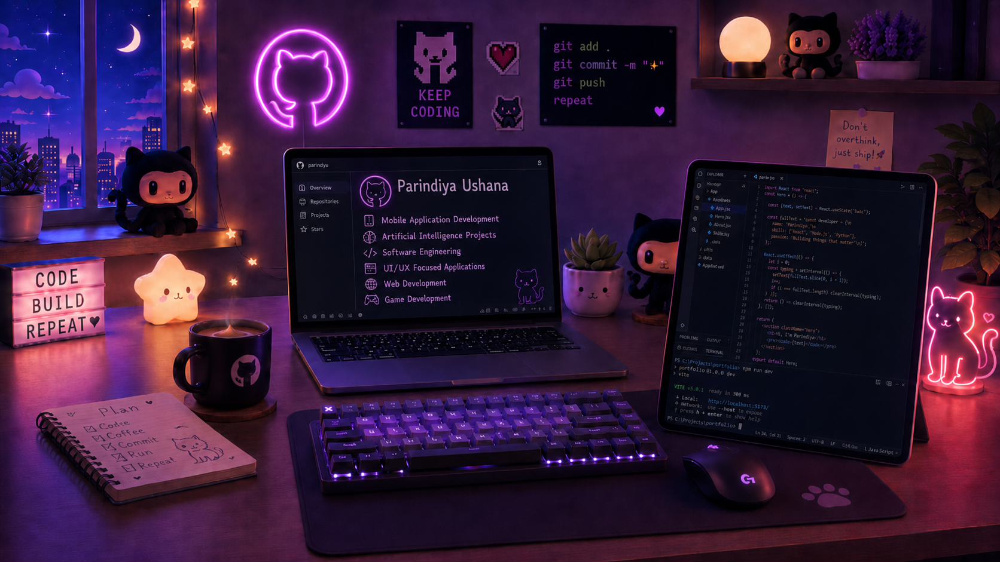

  

<h1 align="center">
  
</h1>

Software Developer • Mobile Application Developer • AI & Software Engineering Enthusiast

Passionate about building scalable applications, modern mobile experiences, and intelligent software solutions.

---

# 💻 Tech Stack

<h3 align="center">📱 Mobile Development</h3>

---

<h3 align="center">🌐 Web & Full Stack Development</h3>

---

<h3 align="center">🤖 AI • Software Engineering • Programming</h3>

---

<h3 align="center">🗄️ Database & Cloud</h3>

---

<h3 align="center">🎨 UI/UX • Design • Creative Tools</h3>

---

<h3 align="center">⚙️ Tools & Platforms</h3>

---

  

  

  

---

# 🚀 What I Do

- 📱 Mobile Application Development
- 🤖 Artificial Intelligence Projects
- 💻 Software Engineering
- 🎨 UI/UX Focused Applications
- 🌐 Full Stack Web Development
- 🚀 Frontend Development
- 🧠 Creative & Interactive Coding

---

# 🌱 Currently Learning

- Advanced Flutter Development
- AI Integrations
- Scalable Mobile Architectures
- Modern UI/UX Design
- Full Stack Development

---

# 🌐 Connect With Me

---

Thanks for visiting my profile ✨💜

